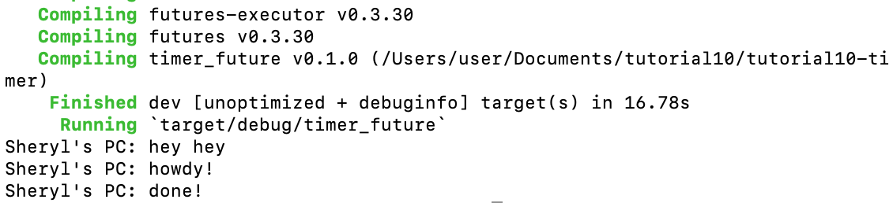
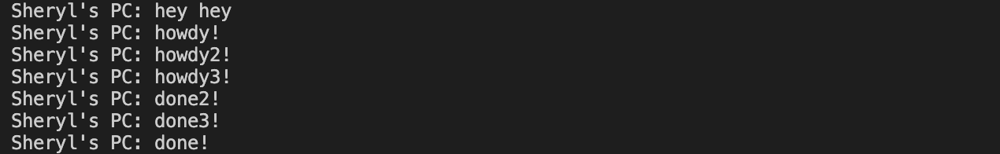

# Tutorial10 timer
Nama: Sheryl Ivana Widjaja 
NPM:2206824943 
Kelas: Advprog A  

## Refleksi 1

##### 1.2 Understanding how it works. 

Fungsi async bekerja secara independen dari fungsi utama yang memanggilnya. Ini berarti bahwa pelaksanaan fungsi async tidak bergantung pada pelaksanaan fungsi utama yang memanggilnya. Karena sifat asinkronusnya, urutan output dari program bisa berubah. Ada kemungkinan bahwa kode di luar fungsi async dieksekusi sebelum fungsi async selesai, yang menyebabkan perubahan urutan output yang diharapkan.

Saat menjalankan `cargo run`, ada kemungkinan "hey hey" muncul sebelum "howdy!" dan "done!". Hal ini disebabkan oleh fakta bahwa pernyataan `println!("hey hey");` berada di luar fungsi *async*, sehingga dapat dieksekusi secara independen dari eksekusi fungsi *async*.

###### 1.2. 1.3. Multiple Spawn and removing drop.

* Adanya lebih banyak *spawner* mengakibatkan peningkatan jumlah tugas yang dieksekusi karena banyaknya tugas yang ditambahkan ke dalam antrian pesan oleh pengirim tugas.
* Ketika *spawner* tidak dihapus, program tidak akan pernah berhenti karena diasumsikan masih ada transmisi data dari *spawner*. `drop(spawner)` menandakan bahwa interaksi telah selesai dan *spawner* akan ditutup.
* Ketika *spawner* memanggil fungsi `spawn`, itu menciptakan tugas baru yang dikirimkan ke dalam pengirim tugas.
* Eksekutor akan mengambil satu tugas dari pengirim tugas dan menjalankannya. Selanjutnya, eksekutor akan mengambil tugas lain dari antrian hingga seluruh tugas selesai.
* Penghapusan *spawner* dengan `drop(spawner)` menunjukkan bahwa interaksi telah selesai. Ketika semua tugas telah dieksekusi dan *spawner* di-*drop*, itu menunjukkan bahwa interaksi telah selesai.